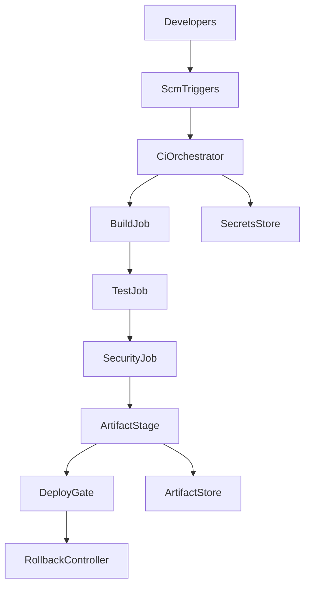
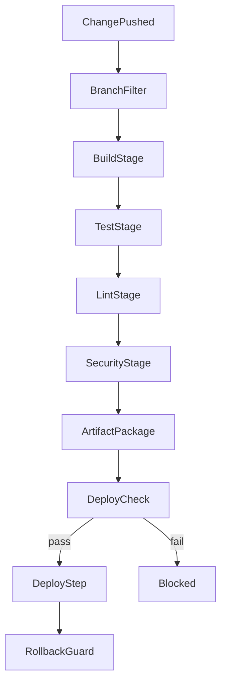
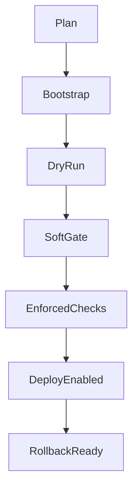

# Design Document

## Overview
This design defines a CI/CD pipeline for Conestoga that enforces reproducible Python 3.12 builds, deterministic headless testing, and gated promotion with security controls. It introduces a staged workflow that validates code on push/PR, scans for secrets and vulnerabilities, packages artifacts with checksums, and verifies deployment prerequisites.
Target users are contributors and maintainers who need fast feedback on changes, reliable release packaging, and guarded deployment gates. The pipeline limits drift from repository standards (uv, ruff, pytest) and keeps Gemini-dependent paths safe via secret validation and fallback awareness.
Impact: adds automated quality and release checks without altering runtime game architecture; branch protections will rely on pipeline results to block unsafe merges.

### Goals
- Enforce branch/PR triggers with required checks before merge (req 1.1-1.3).
- Guarantee reproducible uv-based builds and traceable artifacts (req 2.1-2.4, 5.1-5.3).
- Run deterministic headless tests, lint, and security scans with actionable feedback (req 3.1-3.4, 4.1-4.3).
- Gate deployments on prerequisites and provide rollback safety (req 5.4-5.6).

### Non-Goals
- Defining production hosting targets or infra-as-code; deployment scripts remain placeholders until targets are chosen.
- Implementing new gameplay features or runtime telemetry changes.
- Shipping container images; artifacts focus on Python wheels/sdists and asset bundles.

## Architecture

### Existing Architecture Analysis
- No current CI; Makefile provides `uv sync`, `uv run pytest`, `uv run ruff`. Headless mode supported via `CI`/`UI_HEADLESS` envs. Python 3.12 is the supported runtime per steering.
- Pipeline must avoid modifying game packages; it orchestrates existing commands and assets.

### High-Level Architecture

Architecture Integration:
- Existing patterns preserved: headless testing, uv-managed dependencies, fallback-friendly behavior.
- New components rationale: orchestrator enforces triggers; dedicated jobs isolate build/test/security concerns; deploy gate blocks unsafe promotions; rollback controller prevents concurrent deploys.
- Technology alignment: GitHub Actions runner with uv/ruff/pytest; gitleaks + pip-audit for security; Actions artifacts for retention.
- Steering compliance: no import-time side effects; deterministic tests; validation before state mutation.

## Technology Stack and Design Decisions

### Technology Stack
- Orchestration: GitHub Actions workflow with branch/tag filters and required checks.
- Runtime: Python 3.12 on ubuntu runners; uv for dependency resolution and caching.
- Build: `uv sync --all-extras`, `uv build` to produce wheel/sdist; commit metadata embedded via git describe.
- Testing: `uv run pytest` with `CI=1 UI_HEADLESS=1`; optional coverage artifact; temp dirs per job to isolate data.
- Quality: `uv run ruff check .` and `uv run ruff format --check .` for formatting drift.
- Security: gitleaks for secret scanning; pip-audit for dependency CVEs (fail on high); redaction filter on logs.
- Artifacts: GitHub Actions artifact store; SHA256 checksums; optional asset zip built from `assets/`.
- Deployment gate: shell/uv script validates required secrets (`GEMINI_API_KEY` etc.) and environment readiness before running deploy hook.

### Key Design Decisions
- **Decision: GitHub Actions as orchestrator**
  - Context: Need branch/PR triggers with status reporting (1.x) and low-overhead hosting.
  - Alternatives: GitLab CI, Jenkins.
  - Selected Approach: Actions workflow with required status checks and environment protection rules.
  - Rationale: Native repo integration, minimal infra, easy branch protection wiring.
  - Trade-offs: Ties to GitHub; runner limits may gate parallelism.
- **Decision: uv-locked builds with cache invalidation**
  - Context: Reproducibility requirements (2.1-2.3) and performance.
  - Alternatives: pip/venv, containerized builds.
  - Selected Approach: `uv sync` with lockfile hash checks; fail on mismatch; cache keyed by `uv.lock` hash and Python version.
  - Rationale: Aligns with repo tooling; deterministic deps; fast reruns.
  - Trade-offs: uv cache management required; runners must have Rust toolchain preinstalled (uv dependency).
- **Decision: Security scanning with gitleaks + pip-audit and log redaction**
  - Context: Secret/vulnerability blocking (4.1-4.3).
  - Alternatives: trufflehog, safety.
  - Selected Approach: gitleaks ruleset for repo patterns; pip-audit for PyPI advisories; wrapper scripts mask secrets in logs.
  - Rationale: Lightweight, standard, fails on high severity; complements branch protections.
  - Trade-offs: Possible false positives; requires periodic ruleset updates.

## System Flows

- BranchFilter enforces `main`, `release/*`, and tags; PRs trigger status checks.
- BuildStage installs deps and builds artifacts; TestStage runs pytest headless; LintStage runs ruff; SecurityStage runs gitleaks + pip-audit.
- ArtifactPackage uploads wheel/sdist/assets with checksums; DeployCheck verifies secrets/config; RollbackGuard prevents concurrent deploys during rollback.

## Requirements Traceability
| Requirement | Requirement Summary | Components | Interfaces | Flows |
|-------------|--------------------|------------|------------|-------|
| 1.1 | Trigger on default/release branches | CiOrchestrator, BranchFilter | Workflow triggers | System Flows: BranchFilter |
| 1.2 | PR status reported before merge | CiOrchestrator, StatusReporter | Status checks API | System Flows: BranchFilter |
| 1.3 | Block merge if checks missing | MergeGate, CiOrchestrator | Branch protection settings | System Flows: BranchFilter |
| 2.1 | Use lockfile for installs | BuildJob | uv install contract | System Flows: BuildStage |
| 2.2 | Fail on lock mismatch | BuildJob | Lock validation script | System Flows: BuildStage |
| 2.3 | Stamp artifacts with commit metadata | ArtifactStage | Packaging script | System Flows: ArtifactPackage |
| 2.4 | Target Python 3.12 runtime | CiOrchestrator, BuildJob | Runner matrix config | System Flows: BuildStage |
| 3.1 | Deterministic headless tests | TestJob | Pytest command | System Flows: TestStage |
| 3.2 | Fail run and expose logs on test fail | TestJob, StatusReporter | Test report artifact | System Flows: TestStage |
| 3.3 | Lint/format on Python changes | LintJob | Ruff commands | System Flows: LintStage |
| 3.4 | Isolate temp data during tests | TestJob | Temp dir setup | System Flows: TestStage |
| 4.1 | Secret scanning | SecretScanJob | gitleaks config | System Flows: SecurityStage |
| 4.2 | Fail on high-severity vulnerabilities | DependencyScanJob | pip-audit command | System Flows: SecurityStage |
| 4.3 | Redact sensitive info in logs | LogSanitizer, CiOrchestrator | Log filter hook | System Flows: SecurityStage |
| 5.1 | Package game artifacts | ArtifactStage | uv build + asset bundle | System Flows: ArtifactPackage |
| 5.2 | Checksums for integrity | ArtifactStage | Checksum script | System Flows: ArtifactPackage |
| 5.3 | Block promotion on publish failure | ArtifactStage, DeployGate | Promotion gate | System Flows: ArtifactPackage |
| 5.4 | Verify deploy prerequisites | DeployGate | Preflight script | System Flows: DeployCheck |
| 5.5 | Abort deploy on missing secrets/configs | DeployGate, SecretsStore | Secrets check | System Flows: DeployCheck |
| 5.6 | Block deployments during rollback | RollbackController | Lock/flag file | System Flows: RollbackGuard |

## Components and Interfaces

### Orchestration Layer

#### CiOrchestrator (GitHub Actions workflow)
**Responsibility & Boundaries**
- Primary Responsibility: Coordinate jobs across triggers, enforce dependencies, and publish status results.
- Domain Boundary: CI automation for Conestoga repo.
- Data Ownership: Workflow run metadata, environment variables, job artifacts references.
- Transaction Boundary: Single workflow run.

**Dependencies**
- Inbound: ScmTriggers (push/PR events), MergeGate configuration.
- Outbound: BuildJob, TestJob, LintJob, SecretScanJob, DependencyScanJob, ArtifactStage, DeployGate.
- External: GitHub Actions runner, GitHub API for statuses, SecretsStore.

**Contract Definition (Batch/Job)**
- Trigger: push to `main`, `release/*`, tags `v*`, PRs.
- Input: commit SHA, branch/tag, PR metadata.
- Output: job statuses, artifacts, PR status checks.
- Idempotency: reruns produce fresh artifacts keyed by SHA; caches keyed by lock hash.
- Recovery: rerun workflow or targeted jobs on failure; caches purged when lockfile hash differs.

#### BranchFilter
- Responsibility: Filter branches/tags per triggers and matrix; short-circuit unsupported branches.
- Dependencies: CiOrchestrator.
- Contract (Service Interface): `should_run(event) -> bool` with inputs event type/branch/tag; precondition: event parsed; postcondition: downstream jobs only queued when true.

#### MergeGate
- Responsibility: Enforce required checks before merge via branch protection rules.
- Dependencies: GitHub repository settings, StatusReporter.
- Contract: Required checks list maintained; merge blocked if any required check missing or failing.

#### StatusReporter
- Responsibility: Publish per-job and overall statuses to PRs and commits.
- Contract: Posts check runs with URLs to logs/artifacts; precondition: job outcome available; postcondition: status recorded.

### Build and Quality Layer

#### BuildJob
- Responsibility: Install deps via uv and produce wheel/sdist stamped with commit metadata.
- Dependencies: CiOrchestrator, uv, git.
- Contract (Batch/Job):
  - Trigger: on workflow start.
  - Input: `uv.lock`, `pyproject.toml`, commit SHA.
  - Output: wheel/sdist artifacts, build logs.
  - Preconditions: Python 3.12 runner available; lockfile present.
  - Postconditions: artifacts built, checksum generated.
  - Idempotency: outputs keyed by SHA; cache invalidates on lockfile hash change.

#### TestJob
- Responsibility: Run pytest in headless mode with isolated temp dirs.
- Dependencies: BuildJob artifacts (optional), CiOrchestrator.
- Contract (Batch/Job): inputs codebase, environment vars `CI=1`, `UI_HEADLESS=1`; outputs test report/logs; recovery via rerun; fails fast on first failing suite.

#### LintJob
- Responsibility: Run `uv run ruff check .` and format check.
- Dependencies: CiOrchestrator.
- Contract: inputs code tree; outputs lint report; failure blocks merge.

### Security and Compliance Layer

#### SecretScanJob
- Responsibility: Scan repository diff/history for secrets using gitleaks.
- Dependencies: CiOrchestrator.
- Contract: inputs commit range; outputs scan report; fail on findings.

#### DependencyScanJob
- Responsibility: Scan Python dependencies for CVEs via pip-audit; fail on high severity.
- Dependencies: BuildJob environment.
- Contract: inputs installed packages list; outputs vulnerability report artifact.

#### LogSanitizer
- Responsibility: Mask sensitive values in logs and artifacts.
- Dependencies: CiOrchestrator logging hooks.
- Contract: intercepts stdout/stderr, applies regex masks; ensures secrets appear as `***` in logs.

### Release and Deployment Layer

#### ArtifactStage
- Responsibility: Package wheel/sdist and asset zip; upload with checksums and commit metadata.
- Dependencies: BuildJob outputs, git metadata, ArtifactStore.
- Contract (Batch/Job): trigger after scans; inputs artifacts; outputs uploaded packages plus checksum manifest; failure blocks promotion.

#### ArtifactStore
- Responsibility: Hold workflow artifacts with retention policy.
- Dependencies: Actions artifact service (default) or external bucket.
- Contract: upload/download operations; integrity verified via SHA256.

#### DeployGate
- Responsibility: Validate required secrets/configs before deployment, then execute deployment script.
- Dependencies: SecretsStore, ArtifactStage outputs.
- Contract (Batch/Job): inputs artifact references and environment metadata; preconditions: required secrets present; postconditions: deploy triggered or aborted with message; idempotent by enforcing one deployment per commit/environment.

#### RollbackController
- Responsibility: Coordinate rollback execution and block concurrent deploys during rollback.
- Dependencies: DeployGate.
- Contract: maintains rollback lock flag; ensures new deploys wait until flag cleared; records rollback result.

#### SecretsStore
- Responsibility: Manage CI secrets (e.g., `GEMINI_API_KEY`, signing keys) with masked output.
- Dependencies: GitHub secrets (or environment-specific store).
- Contract: provides read-only env injection; denies logging raw values.

## Data Models
- **BuildArtifact**: `{ name: str, version: str, sha256: str, commit_sha: str, built_at: datetime }`.
- **AssetBundle**: `{ name: str, files: list[str], sha256: str, commit_sha: str }`.
- **TestReport**: `{ status: str, failed_tests: list[str], log_url: str, created_at: datetime }`.
- **VulnerabilityReport**: `{ package: str, version: str, severity: str, advisory_id: str, fix_version: str }`.
- **DeployPreflightResult**: `{ environment: str, missing_secrets: list[str], status: str, checked_at: datetime }`.

## Error Handling
- Fail fast on lockfile mismatch, missing secrets, or scan findings; surface actionable messages in PR status.
- Retry strategy: allow reruns of failed jobs; refresh caches when hash changes; rerun deploy after clearing rollback lock.
- Log sanitization ensures secrets masked; redaction applied before artifact upload.
- Category responses: user errors (missing lockfile/secret) → descriptive failure; system errors (runner outage) → mark unstable and allow rerun; business errors (policy violation) → block merge/deploy until resolved.

## Testing Strategy
- Unit: validate helper scripts (e.g., checksum generator, preflight validator) with Python type hints and fixtures.
- Integration: dry-run workflow using Actions `act` or workflow dispatch to confirm job ordering and env variables; verify gitleaks/pip-audit exit codes.
- E2E: full workflow on PR against test branch with seeded failure cases (lint fail, test fail, missing secret) to validate gates.
- Performance: measure workflow time with and without uv cache; ensure cache hit ratio tracked via job summary.

## Security Considerations
- Principle of least privilege for secrets; restrict deployment secrets to deploy job scope.
- Secret scanning on every PR/push; dependency scanning fails on high severity.
- Log redaction enforced globally; artifacts avoid storing raw secrets or tokens.
- Branch protections require passing checks; deploy environment requires approval if supported.

## Performance & Scalability
- Use uv cache keyed by Python version and lock hash; prune cache on hash change.
- Parallelize lint and tests where possible while maintaining dependency ordering for security scans and release packaging.
- Artifact retention policy to control storage; compress assets to reduce upload size.

## Migration Strategy

- Plan: confirm branch/tag patterns and required checks list.
- Bootstrap: add workflow with build/test/lint/scans in non-blocking mode.
- DryRun: run on PRs, collect timings and false positives.
- SoftGate: enable status checks as required on select branches.
- EnforcedChecks: make all required checks blocking; artifact publishing enabled.
- DeployEnabled: add deploy gate with secret verification; approvals as needed.
- RollbackReady: document rollback script and lock mechanism; block concurrent deploys during rollback.
