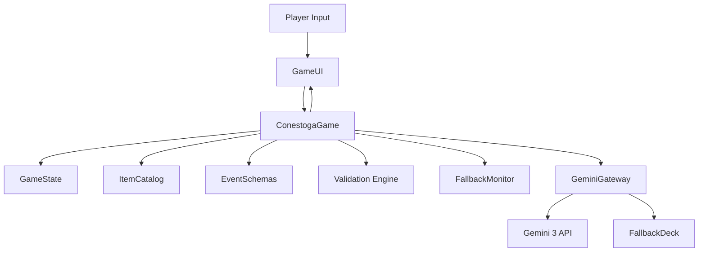

# Design Document — core-game

## Overview 
Core design for the Conestoga gameplay loop: a Pygame-driven Oregon Trail experience with Gemini 3-generated events, deterministic state updates, and resilient fallback behavior. Players advance through travel ticks, encounter contextual events, choose resolutions, and see immediate state changes with clear UI feedback.

### Goals
- Maintain paced travel loop with reliable event triggering and progression visibility.
- Keep Gemini 3 integration isolated, validated, and resilient with fallback-first safety.
- Ensure UI responsiveness with clear loading/choice feedback and consistent state logging.

### Non-Goals
- New content authoring tools or event authoring UI.
- Persisted saves or multiplayer synchronization.
- Server-side services beyond existing offline/LLM flows.

## Architecture

### Existing Architecture Analysis
- State machine and loop live in `ConestogaGame` (`runner.py`), feeding `GameUI` (Pygame) and maintaining `GameState`.
- Gemini calls are isolated in `GeminiGateway` (`gemini_gateway.py`) with retries, validation, and fallback via `FallbackDeck` in `events.py`.
- Schemas and validation for `EventDraft`/`EventResolution` and inventory live in `events.py` and `state.py`; UI logging handled in `ui.py`.

### High-Level Architecture

- Patterns preserved: prefetch-first generation, validation before mutation, fallback on failure/quota, UI log updates per transition.
- Technology alignment: Python 3.12 + Pygame CE; `google-genai` for Gemini 3; threading for prefetch; `.env` for keys; validator and fallback monitor keep gateway lean.

### Technology Stack and Design Decisions
- **Runtime/UI**: Python 3.12, Pygame CE loop; continue `uv` tooling for reproducibility.
- **LLM Boundary**: `google-genai` client pinned to Gemini 3 models; JSON validation + retries (2) + offline fallback.
- **Concurrency**: Background thread for event prefetch with lock-guarded handoff; main thread owns UI/state mutation.

**Key Design Decisions**
- **Decision**: Keep Gemini integration confined to `GeminiGateway` with structured prompts and schema validation.  
  **Context**: Requirement 2 mandates resilience and fallback when LLM unavailable.  
  **Alternatives**: Inline model calls in runner; separate microservice boundary.  
  **Selected Approach**: Gateway module with retry, schema parse, and fallback delegation.  
  **Rationale**: Centralizes error handling/quota detection; simplifies testing; aligns with existing pattern.  
  **Trade-offs**: Gateway complexity increases; must maintain prompt/schema in sync with event models.
- **Decision**: Background prefetch thread for events; resolutions on-demand.  
  **Context**: Requirement 1/2/4 need responsive UI and reduced perceived latency.  
  **Alternatives**: All synchronous generation; prefetch resolutions too.  
  **Selected Approach**: Prefetch next event only; resolutions generated when chosen.  
  **Rationale**: Reduces first-paint latency and avoids wasted resolutions.  
  **Trade-offs**: Thread coordination needed; slight delay on first resolution.
- **Decision**: Validation-first state updates with catalog-enforced inventory.  
  **Context**: Requirement 3 needs fair, consistent effects.  
  **Alternatives**: Apply-and-check; lenient item handling.  
  **Selected Approach**: Validate effects and item IDs before mutation; reject invalid effects.  
  **Rationale**: Prevents corrupted state and inconsistent UI; keeps fallback honest.  
  **Trade-offs**: Requires explicit handling when validation fails (fallback or no-op with log).
- **Decision**: Centralize fallback/offline signaling.  
  **Context**: Requirement 2/5 require visible fallback usage and quota/offline handling.  
  **Alternatives**: Ad hoc logging inside gateway; silent failover.  
  **Selected Approach**: FallbackMonitor to record sources/reasons; Runner updates UI status and logs when Gemini is offline or fallback is used.  
  **Rationale**: Clear observability and player feedback; enables tests on fallback paths.  
  **Trade-offs**: Slightly more coordination between gateway and runner threads.

## System Flows

### Event Trigger and Resolution Flow
```mermaid
sequenceDiagram
    participant Loop as ConestogaGame
    participant UI as GameUI
    participant GW as GeminiGateway
    participant FB as FallbackDeck
    Loop->>Loop: Advance day/miles, evaluate trigger
    Loop->>UI: Show LOADING (if no prefetched event)
    Loop->>GW: Request EventDraft (prefetch or on-demand)
    alt Gemini success
        GW-->>Loop: Validated EventDraft
    else Failure/timeout/invalid
        GW-->>FB: Request fallback event
        FB-->>Loop: Fallback EventDraft
    end
    Loop->>UI: Render event + choices
    UI->>Loop: Player selects choice
    Loop->>GW: Request resolution (choice)
    alt Gemini success
        GW-->>Loop: EventResolution
    else Failure/invalid
        GW-->>FB: Request fallback resolution
        FB-->>Loop: EventResolution (fallback)
    end
    Loop->>State: Apply validated effects
    Loop->>UI: Log outcome and updated resources
    Loop->>Loop: Return to TRAVEL, start next prefetch
```

## Requirements Traceability
- **Requirement 1.1–1.4**: Travel progression and mode transitions in `ConestogaGame` state machine; UI log updates.  
- **Requirement 2.1–2.4**: Event generation and resilience in `GeminiGateway` + `FallbackDeck`; choice count enforcement; quota/offline flag handling via `FallbackMonitor`.  
- **Requirement 3.1–3.4**: Choice validation, resolution engine, catalog checks, and UI logging in runner + events/state + validator.  
- **Requirement 4.1–4.4**: Loading indicators, timeout fallback, choice availability display, resource refresh in `GameUI` + runner; fallback logging to UI.  
- **Requirement 5.1–5.3**: Failure logging, fallback-only mode, source annotations in `GeminiGateway`, `FallbackMonitor`, and runner logs.

## Components and Interfaces

### Game Loop (`ConestogaGame`)
- **Responsibility & Boundaries**: Owns travel loop, mode transitions, event/resolution orchestration, and UI notifications.
- **Dependencies**: `GameState`, `ItemCatalog`, `GeminiGateway`, `FallbackDeck` (indirect via gateway), `GameUI`, `EventDraft/EventResolution`.
- **Contract (Python type hints)**:
```python
class ConestogaGame:
    def start_prefetch(self) -> None: ...
    def trigger_event(self) -> None: ...
    def resolve_choice(self, choice_index: int) -> None: ...
    def _apply_resolution(self, resolution: EventResolution) -> None: ...
```
- **Preconditions**: State initialized; UI ready; Gemini gateway configured (may be offline).  
- **Postconditions**: After resolution, state/UI reflect updated resources; next prefetch scheduled.

### Gemini Boundary (`GeminiGateway`)
- **Responsibility**: Build prompts, call Gemini 3 models, parse/validate JSON, detect quota exhaustion, and delegate to fallback on failure.
- **Dependencies**: `google-genai` client; `FallbackDeck`; `ItemCatalog` for validation context.
- **Contract**:
```python
class GeminiGateway:
    def generate_event_draft(self, game_state: GameState, item_catalog: ItemCatalog, tier: str = "minor") -> EventDraft: ...
    def generate_event_resolution(self, event_draft: EventDraft, choice_id: str, game_state: GameState) -> EventResolution | None: ...
```
- **Invariants**: Only Gemini 3 models; retry cap 2; validation guards on parsed output; resource exhaustion flag prevents repeated failing calls.

### Event Prefetch & Resolution Engine
- **Responsibility**: Background thread fetches next `EventDraft`; on-demand resolution fetch applies chosen effects.
- **Concurrency**: Thread-safe handoff via lock; cancellation flag to avoid stale writes; main thread applies effects.
- **Error Handling**: Timeouts/validation failures trigger fallback; mode switches to LOADING when no prefetched event; monitor records fallback source/reason.

### State & Catalog (`GameState`, `ItemCatalog`)
- **Responsibility**: Maintain deterministic resources, party, inventory; provide catalog for allowed items.
- **Contracts**: Methods to adjust resources/items must validate against catalog and invariants (no negative counts beyond allowed rules).
- **Invariants**: Resource bounds enforced; party health tracked; inventory items must exist in catalog.

### Event Models (`EventDraft`, `EventResolution`, `Choice`, `Effect`)
- **Responsibility**: Typed representations of events/choices/effects; validation of allowed operations and catalog references.
- **Contracts**: Validation methods enforce 2–3 choices, unique IDs, non-empty text; effects must target allowed resources/items and permitted operations.
- **Data Ownership**: Event IDs, titles, narratives, choices (2–3 options), effects.

### UI Layer (`GameUI`)
- **Responsibility**: Render travel status, events, choices, loading states, and log updates; capture player input.
- **Contracts**: Methods to add log entries with severity; update resource display; present selectable choices with disabled states and reasons.
- **State**: `gemini_online` flag to display offline/fallback mode.

### Validation & Fallback Monitoring
- **Validator**: Enforces choice counts (2–3), unique IDs, non-empty text, and effect targets (allowed resources, catalog-backed items). Used by gateway parsing and runner safeguards.
- **FallbackMonitor**: Tracks fallback usage and offline/quota signals; exposes reason summaries for UI logging; ensures runner marks Gemini status and logs fallback source.

### Fallback Content (`FallbackDeck`)
- **Responsibility**: Deterministic deck of events/resolutions for offline/quota scenarios or validation failures.
- **Contracts**: Provide `get_random_event(game_state)` and `get_resolution(event_id, choice_id)` ensuring schema compliance.

### Observability
- **Logging**: Gateway logs failures and fallback usage; runner logs mode transitions and applied effects; UI logs player-facing messages.
- **Flags**: `resource_exhausted` drives offline mode; loading timeout triggers fallback and log note.

## Data Models
- **GameState**: day, miles_traveled/target_miles, party list/health, resources (food, water, money, ammo), inventory dict, flags.  
- **EventDraft**: event_id, title, narrative, choices (id, text, prerequisites), tier.  
- **EventResolution**: text, effects (operation, target, value/item_id), optional flags; must pass catalog validation before apply.  
- **Catalog**: item definitions (id, name, type); used for validation in events/resolutions.

## Error Handling
- **LLM Errors**: Retry (max 2) then fallback; set offline flag on quota exhaustion; log reason.  
- **Validation Errors**: Reject invalid event/resolution; substitute fallback; log validation issues.  
- **Timeouts**: Loading timeout triggers fallback event/resolution and UI notice.  
- **State Conflicts**: Prevent applying effects referencing unknown items; log and fallback/skip effect.

## Testing Strategy
- **Unit**: Deterministic tests for state transitions, event validation, resolution application, and fallback activation (seed randomness).  
- **Integration**: Simulate event trigger + resolution flow with Gemini stubbed only at gateway boundary; verify UI log messages and mode transitions.  
- **Resilience**: Tests for offline mode (no key), quota exhaustion flag, timeout -> fallback path.  
- **Tooling**: `uv run pytest` or `make test`; use `scripts/test-pre.sh`/`test-post.sh` when Docker services are needed (not expected for core loop).  
- **Audits**: When heuristic audits run, wrap LLM reviewer via LangChain; capture findings without blocking core suite.

## Performance & Scalability
- Keep prefetch thread lightweight; avoid blocking UI loop.  
- Bound loading timeout (default 5s) to prevent UI stalls; consider config for lower-end hardware.  
- Cache last prefetched event only; avoid bulk prefetch to limit memory/LLM usage.

## Security Considerations
- Never log `GEMINI_API_KEY`; use `.env`.  
- Ensure prompts avoid injecting secrets; no external network calls outside Gemini gateway.  
- Validate all LLM outputs before applying to game state.
