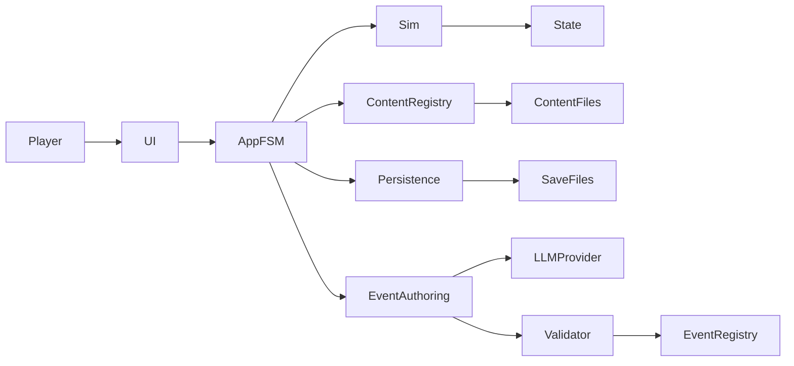
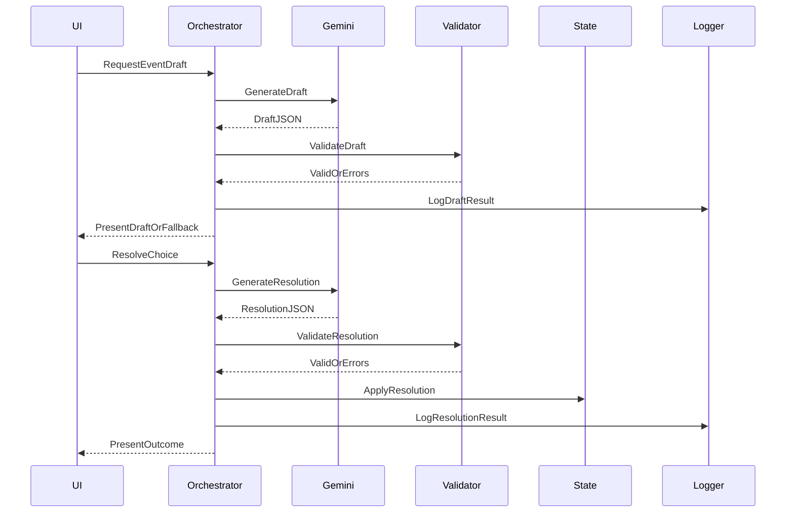
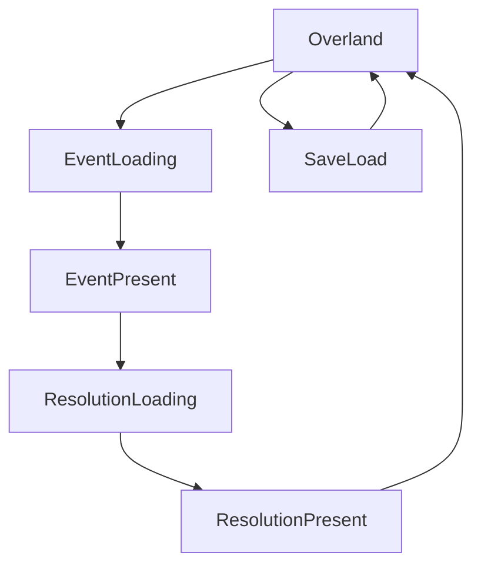
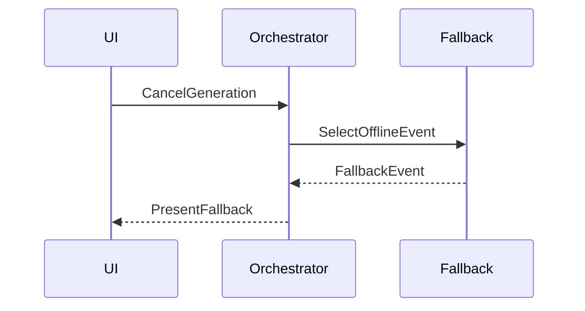
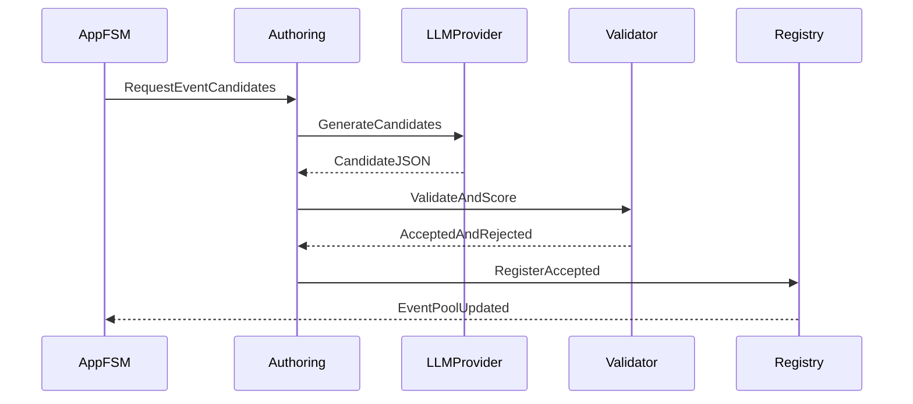
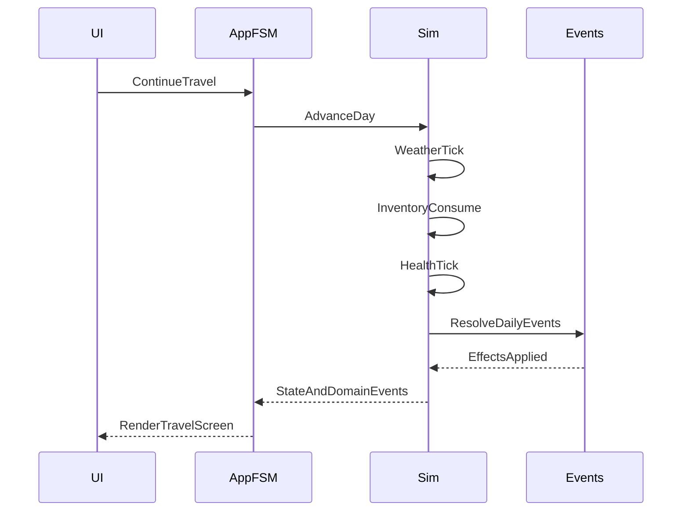

# Design Document

## Overview
Conestoga delivers a desktop, Oregon Trail-inspired journey simulation where Gemini generates structured EventDrafts and EventResolutions that the engine validates and applies deterministically. The design emphasizes a strict separation between authoritative simulation and LLM-driven narrative generation to preserve safety, determinism, and testability.

The engine is modular and data-driven: simulation systems operate over a single GameState, the UI renders state and emits player intents, and content packs define routes, landmarks, events, and tuning tables. An LLM-assisted event authoring pipeline can generate safe, schema-valid event definitions with validation, balance checks, and optional human review. This supports extensibility for new terrains, landmark types, minigames, and event categories without changing core code.

The primary users are players (interactive journey), hackathon judges (fast demo and obvious Gemini integration), developers (clear contracts and deterministic state), and content curators (historical grounding and cultural safety). The system introduces a layered architecture with explicit integration boundaries for Gemini, validation, and persistence to enable reliable fallback behavior and non-blocking UI.

### Goals
- Maintain a deterministic core loop with validated, state-aware events and outcomes.
- Keep UI responsive during Gemini calls with asynchronous generation and cancellation.
- Provide robust validation, repair, and fallback to guarantee gameplay continuity.
- Surface Gemini integration clearly through debug overlays, logs, and submission artifacts.
- Ensure content is data-driven and extensible for routes, landmarks, events, and tuning.
- Support LLM-assisted event authoring with strict schema validation and balance gating.

### Non-Goals
- Multiplayer, online accounts, or payments.
- 3D simulation or complex combat systems.
- Medical/mental health diagnostics or treatment advice.
- Function calling as a required dependency.
- Perfect historical accuracy or a full NPC dialogue engine in the initial release.

## Requirements Traceability

| Requirement | Summary | Components | Interfaces | Flows |
|-------------|---------|------------|------------|-------|
| 1.1 | Initialize valid game state | StateStore, GameSimulator | StateStore | TravelTickFlow |
| 1.2 | Advance time and evaluate event triggers | GameSimulator, EventOrchestrator | GameSimulatorService | TravelTickFlow |
| 1.3 | Present event narrative and choices | UIStateController, PygameUI | UIStateController | UIStateFlow |
| 1.4 | Apply deterministic outcomes to state | GameSimulator, ValidationEngine | GameSimulatorService | ChoiceResolutionFlow |
| 1.5 | End run with summary | GameSimulator, PygameUI | UIStateController | UIStateFlow |
| 2.1 | Display map and position | PygameUI | UIStateController | UIStateFlow |
| 2.2 | Move to adjacent tile | GameSimulator, UIStateController | GameSimulatorService | TravelTickFlow |
| 2.3 | Block non-traversable movement | GameSimulator | GameSimulatorService | TravelTickFlow |
| 2.4 | Re-render without freezing | UIStateController, AsyncWorker | AsyncWorker | UIStateFlow |
| 3.1 | Include required fields in game state | StateStore | StateStore | StateSummaryFlow |
| 3.2 | Enforce invariants on mutation | GameSimulator, ValidationEngine | GameSimulatorService | ChoiceResolutionFlow |
| 3.3 | Produce deterministic state summary | StateStore, PromptBuilder | StateSummaryService | EventGenerationFlow |
| 3.4 | Status screen shows authoritative state | PygameUI | UIStateController | UIStateFlow |
| 4.1 | Load item catalog with stable IDs | StateStore | StateStore | TravelTickFlow |
| 4.2 | Validate referenced item IDs | ValidationEngine | ValidationService | EventGenerationFlow |
| 4.3 | Reject unknown item IDs | ValidationEngine | ValidationService | EventGenerationFlow |
| 4.4 | Update UI on inventory change | UIStateController, PygameUI | UIStateController | ChoiceResolutionFlow |
| 4.5 | Normalize emergent items to stable IDs | ItemCatalogService, ValidationEngine | ItemCatalogService | ChoiceResolutionFlow |
| 4.6 | Maintain machine-checkable inventory | StateStore | StateStore | StateSummaryFlow |
| 5.1 | Enforce schema-only JSON output | GeminiGateway, PromptBuilder | GeminiGateway | EventGenerationFlow |
| 5.2 | Validate response against schema | ValidationEngine | ValidationService | EventGenerationFlow |
| 5.3 | Treat valid schema as executable | EventOrchestrator | EventOrchestratorService | EventGenerationFlow |
| 5.4 | Route schema failures to repair/fallback | EventOrchestrator, RepairService | EventOrchestratorService | FallbackFlow |
| 5.5 | Separate EventDraft and EventResolution schemas | ValidationEngine | ValidationService | EventGenerationFlow |
| 5.6 | Request EventResolution on choice | EventOrchestrator | EventOrchestratorService | ChoiceResolutionFlow |
| 6.1 | Evaluate prerequisites against state | ValidationEngine | ValidationService | EventGenerationFlow |
| 6.2 | Hide/disable choices with reasons | UIStateController | UIStateController | UIStateFlow |
| 6.3 | Allow selection when prerequisites met | UIStateController | UIStateController | UIStateFlow |
| 6.4 | Apply only whitelisted effects | GameSimulator, ValidationEngine | GameSimulatorService | ChoiceResolutionFlow |
| 7.1 | Resolve checks via engine RNG | GameSimulator, RNGService | RNGService | ChoiceResolutionFlow |
| 7.2 | Select success/failure branch | GameSimulator | GameSimulatorService | ChoiceResolutionFlow |
| 7.3 | Repeatable outcomes with fixed seed | RNGService, StateStore | RNGService | ChoiceResolutionFlow |
| 7.4 | Reject invalid check structures | ValidationEngine | ValidationService | EventGenerationFlow |
| 8.1 | Accept only whitelisted effect ops | ValidationEngine | ValidationService | ChoiceResolutionFlow |
| 8.2 | Reject non-whitelisted effect ops | ValidationEngine | ValidationService | ChoiceResolutionFlow |
| 8.3 | Enforce invariants when applying effects | GameSimulator | GameSimulatorService | ChoiceResolutionFlow |
| 8.4 | Abort and revert on invariant failure | GameSimulator, StateStore | StateStore | ChoiceResolutionFlow |
| 9.1 | Regenerate with validation errors | RepairService | RepairService | FallbackFlow |
| 9.2 | Limit regeneration attempts | RepairService | RepairService | FallbackFlow |
| 9.3 | Fall back to safe local deck | FallbackDeck | FallbackService | FallbackFlow |
| 9.4 | Log fallback occurrences | ObservabilityLogger | ObservabilityService | FallbackFlow |
| 9.5 | Apply retry/fallback on API errors | EventOrchestrator | EventOrchestratorService | FallbackFlow |
| 10.1 | Prefetch events asynchronously | AsyncWorker, EventOrchestrator | AsyncWorker | EventGenerationFlow |
| 10.2 | Show non-blocking loading state | UIStateController | UIStateController | UIStateFlow |
| 10.3 | Transition on event arrival | UIStateController | UIStateController | UIStateFlow |
| 10.4 | Maintain responsiveness at target FPS | UIStateController, AsyncWorker | AsyncWorker | UIStateFlow |
| 10.5 | Cancel generation and fallback | UIStateController, FallbackDeck | FallbackService | FallbackFlow |
| 10.6 | Target 80 percent under 2.0 seconds | EventOrchestrator | EventOrchestratorService | EventGenerationFlow |
| 11.1 | Include historical constraints in prompts | PromptBuilder | PromptBuilderService | EventGenerationFlow |
| 11.2 | Limit provenance to short notes | ValidationEngine | ValidationService | EventGenerationFlow |
| 11.3 | Reject anachronistic content | ValidationEngine | ValidationService | EventGenerationFlow |
| 11.4 | Prefer continuity callbacks | PromptBuilder | PromptBuilderService | EventGenerationFlow |
| 12.1 | Avoid stereotypes in prompts | PromptBuilder | PromptBuilderService | EventGenerationFlow |
| 12.2 | No medical advice in output | ValidationEngine, SafetyFilter | SafetyFilterService | EventGenerationFlow |
| 12.3 | Reject safety violations | SafetyFilter | SafetyFilterService | EventGenerationFlow |
| 12.4 | Fall back after repeated violations | FallbackDeck | FallbackService | FallbackFlow |
| 12.5 | Configure Gemini safety settings | GeminiGateway | GeminiGateway | EventGenerationFlow |
| 12.6 | Apply local content filter | SafetyFilter | SafetyFilterService | EventGenerationFlow |
| 13.1 | Schedule follow-up hints | EventOrchestrator | EventOrchestratorService | EventGenerationFlow |
| 13.2 | Increase follow-up probability | EventOrchestrator | EventOrchestratorService | EventGenerationFlow |
| 13.3 | Reference flags/items in follow-up | PromptBuilder | PromptBuilderService | EventGenerationFlow |
| 13.4 | Prevent impossible interactions | ValidationEngine | ValidationService | EventGenerationFlow |
| 14.1 | Save authoritative state locally | PersistenceService | PersistenceService | SaveLoadFlow |
| 14.2 | Load and resume state | PersistenceService, StateStore | PersistenceService | SaveLoadFlow |
| 14.3 | Store bounded event history summary | StateStore | StateStore | SaveLoadFlow |
| 14.4 | Handle corrupted saves gracefully | PersistenceService | PersistenceService | SaveLoadFlow |
| 15.1 | Use canonical fields in state summary | StateStore | StateSummaryService | StateSummaryFlow |
| 15.2 | Bound event history size | StateStore | StateStore | StateSummaryFlow |
| 15.3 | Deterministic summary for identical states | StateStore | StateSummaryService | StateSummaryFlow |
| 15.4 | Display summary and last event IDs in debug | DebugOverlay | DebugOverlayService | UIStateFlow |
| 16.1 | Use low-latency config for minor events | GeminiGateway | GeminiGateway | EventGenerationFlow |
| 16.2 | Use higher reasoning for chapter events | GeminiGateway | GeminiGateway | EventGenerationFlow |
| 16.3 | Apply config changes without code changes | ConfigStore, GeminiGateway | ConfigService | EventGenerationFlow |
| 16.4 | Fall back if model unavailable | FallbackDeck | FallbackService | FallbackFlow |
| 17.1 | Load API key from environment | ConfigStore | ConfigService | StartupFlow |
| 17.2 | No hardcoded keys in repo or bundle | ConfigStore, BuildConfig | ConfigService | StartupFlow |
| 17.3 | Redact secrets in logs | ObservabilityLogger | ObservabilityService | LoggingFlow |
| 17.4 | Offline mode messaging when key missing | UIStateController | UIStateController | UIStateFlow |
| 18.1 | Record event artifacts | ObservabilityLogger | ObservabilityService | LoggingFlow |
| 18.2 | Log validation failures and retries | ObservabilityLogger | ObservabilityService | LoggingFlow |
| 18.3 | Debug overlay fields | DebugOverlay | DebugOverlayService | UIStateFlow |
| 18.4 | Show thought summaries in dev view | DebugOverlay | DebugOverlayService | UIStateFlow |
| 18.5 | Export run summary without secrets | ObservabilityLogger | ObservabilityService | ExportFlow |
| 19.1 | Public demo without login | DemoPackaging | DemoPackaging | ReleaseFlow |
| 19.2 | Reach playable state quickly | UIStateController, StartupFlow | UIStateController | StartupFlow |
| 19.3 | Playable via fallback mode | FallbackDeck | FallbackService | FallbackFlow |
| 19.4 | Restart path after demo end | UIStateController | UIStateController | UIStateFlow |
| 20.1 | Gemini integration write-up | SubmissionArtifacts | SubmissionArtifacts | ReleaseFlow |
| 20.2 | Demo video script or shot list | SubmissionArtifacts | SubmissionArtifacts | ReleaseFlow |
| 20.3 | Architecture diagram in repo | SubmissionArtifacts | SubmissionArtifacts | ReleaseFlow |
| 20.4 | Run instructions in repo | SubmissionArtifacts | SubmissionArtifacts | ReleaseFlow |
| 21.1 | Unit tests for schema, prereqs, effects | TestHarness | TestHarness | TestFlow |
| 21.2 | Integration tests with mocked Gemini | TestHarness | TestHarness | TestFlow |
| 21.3 | Repair loop tests for invalid fixtures | TestHarness | TestHarness | TestFlow |
| 21.4 | Coverage for critical modules | TestHarness | TestHarness | TestFlow |
| 22.1 | Readable event text display | PygameUI | UIStateController | UIStateFlow |
| 22.2 | Clear labels and lock indicators | UIStateController | UIStateController | UIStateFlow |
| 22.3 | Consistent keybindings and hints | UIStateController | UIStateController | UIStateFlow |
| 22.4 | Friendly error recovery | UIStateController | UIStateController | UIStateFlow |

## Architecture

### Existing Architecture Analysis (if applicable)
Conestoga is a greenfield, single-process desktop application with no existing architecture. The steering directory is not present, so no project-level patterns were applied.

### Architecture Pattern & Boundary Map
Selected pattern: Layered core with hexagonal boundaries around external integrations (LLM provider, persistence, telemetry) and content loading.

Architecture Integration:
- Selected pattern: Layered with ports and adapters to isolate deterministic simulation from external services.
- Domain boundaries: UI, Application FSM, Simulation Systems, Content Registry, Event Registry, LLM Event Authoring, Validation/Safety, Persistence, Observability.
- Existing patterns preserved: None (greenfield).
- New components rationale: Each boundary reduces coupling, supports data-driven content, and enforces validation and fallback.
- Steering compliance: No steering context available.



### Technology Stack

| Layer | Choice / Version | Role in Feature | Notes |
|-------|------------------|-----------------|-------|
| Frontend / UI | pygame-ce (pinned) | Desktop rendering, input, UI loop | Use async worker for Gemini calls |
| Backend / Services | Python 3.11 | Game simulation and orchestration | Single-process desktop runtime |
| Data / Storage | Local JSON files | Save/load, logs, and content packs | No server database required |
| Messaging / Events | In-process queues | Async worker handoff | Single in-flight request |
| Infrastructure / Runtime | google-genai SDK (pinned), pydantic v2 | Gemini API + schema validation | SDK details verified in implementation |

## System Flows











## Components and Interfaces

### Component Summary
| Component | Domain/Layer | Intent | Req Coverage | Key Dependencies (P0/P1) | Contracts |
|-----------|--------------|--------|--------------|---------------------------|-----------|
| PygameUI | UI | Render screens and capture input | 1.3, 2.1, 22.1 | UIStateController (P0) | State |
| UIStateController | UI | State machine for UI screens and transitions | 1.3-1.5, 10.2-10.4, 22.2-22.4 | GameSimulator (P0), EventOrchestrator (P0) | Service, State |
| GameFlowFSM | Application | Orchestrate setup, outfitting, travel, landmark, minigame, end | 1.1-1.5, 2.2, 10.2 | GameSimulator (P0), UIStateController (P0) | Service |
| GameSimulator | Domain | Deterministic travel, checks, and effect application | 1.2, 7.1-7.3, 8.3-8.4 | StateStore (P0), RNGService (P0) | Service, State |
| TraversalService | Domain | Validate movement on grid and route graph | 2.1-2.3 | StateStore (P0), ContentRegistry (P0) | Service |
| StateStore | Domain | Authoritative state and summaries | 3.1-3.4, 14.1-14.3, 15.1-15.4 | PersistenceService (P0) | State |
| EventOrchestrator | Application | Coordinate event generation, repair, fallback | 5.1-5.6, 9.1-9.5, 10.1-10.6 | GeminiGateway (P0), ValidationEngine (P0), FallbackDeck (P0) | Service |
| GeminiGateway | Integration | Gemini request/response wrapper | 5.1-5.6, 16.1-16.4, 12.5 | ConfigStore (P0) | Service |
| LLMEventAuthoring | Integration | Generate new event definitions for registry | 5.1-5.5, 9.1-9.3 | GeminiGateway (P0), BalanceValidator (P0) | Service |
| ContentRegistry | Infrastructure | Load routes, landmarks, events, tuning tables | 3.1, 4.1, 11.1 | PersistenceService (P1) | State |
| EventRegistry | Domain | Manage curated and LLM-accepted events | 5.3, 9.3, 13.1 | ContentRegistry (P0) | State |
| BalanceValidator | Domain | Enforce bounds, safety, and balance rules | 8.1-8.4, 12.3-12.6 | ValidationEngine (P0) | Service |
| ItemCatalogService | Domain | Normalize and validate item IDs | 4.1, 4.2, 4.5, 4.6 | ContentRegistry (P0) | Service |
| ValidationEngine | Domain | Schema and semantic validation | 4.2-4.3, 8.1-8.2, 12.3-12.6 | SafetyFilter (P0), ItemCatalogService (P0) | Service |
| SafetyFilter | Domain | Local content filter and safety enforcement | 12.2-12.6 | ValidationEngine (P0) | Service |
| FallbackDeck | Domain | Offline deterministic events | 9.3-9.5, 10.5, 19.3 | StateStore (P0) | Service |
| PersistenceService | Infrastructure | Save/load files, corruption handling | 14.1-14.4 | StateStore (P0) | Service |
| ObservabilityLogger | Infrastructure | Artifacts, debug metrics, redaction | 18.1-18.5, 17.3 | EventOrchestrator (P0) | Service |
| PromptBuilder | Integration | Build prompts and state summaries | 11.1-11.4, 15.1-15.3 | StateStore (P0) | Service |
| DebugOverlay | UI | Dev-only status display | 15.4, 18.3-18.4 | UIStateController (P0) | State |
| MinigameController | UI | Render and resolve minigames with effects | 1.4, 22.1 | UIStateController (P0) | Service |
| DemoPackaging | Release | Public demo entry points | 19.1-19.4 | SubmissionArtifacts (P1) | Service |
| SubmissionArtifacts | Release | Write-up, video, diagram, README | 20.1-20.4 | None | Service |
| TestHarness | QA | Determinism and safety tests | 21.1-21.4 | ValidationEngine (P0) | Service |

### UI Layer

#### UIStateController
| Field | Detail |
|-------|--------|
| Intent | Manage UI state transitions for travel and event flows |
| Requirements | 1.3, 1.5, 2.1, 2.4, 10.2, 10.3, 22.2, 22.3, 22.4 |

**Responsibilities & Constraints**
- Drive state transitions between travel, event, and resolution screens.
- Maintain non-blocking render loop with async worker polling.
- Present locked choices with requirement reasons.

**Dependencies**
- Inbound: PygameUI — rendering surface and input callbacks (P0)
- Outbound: GameSimulator — travel ticks and apply effects (P0)
- Outbound: EventOrchestrator — event draft/resolution requests (P0)
- Outbound: DebugOverlay — dev diagnostics (P1)

**Contracts**: Service [x] / API [ ] / Event [ ] / Batch [ ] / State [x]

##### Service Interface
```python
from typing import Protocol

class UIStateController(Protocol):
    def tick(self, delta_seconds: float) -> None:
        ...

    def on_move(self, direction: str) -> None:
        ...

    def on_choice(self, option_id: str) -> None:
        ...

    def on_cancel_generation(self) -> None:
        ...
```
- Preconditions: Current state is initialized; inputs are validated at the UI boundary.
- Postconditions: State transitions are queued; cancellation triggers fallback flow when generation is pending.
- Invariants: UI state transitions are deterministic for the same inputs.

#### MinigameController
| Field | Detail |
|-------|--------|
| Intent | Render minigames and translate results into effects |
| Requirements | 1.4, 22.1 |

**Responsibilities & Constraints**
- Run hunting and river crossing minigames without mutating state directly.
- Emit deterministic effect bundles for the simulation to apply.

**Dependencies**
- Inbound: UIStateController — state transitions and input routing (P0)
- Outbound: GameSimulator — effect application (P0)

**Contracts**: Service [x] / API [ ] / Event [ ] / Batch [ ] / State [ ]

### Domain Layer

#### GameSimulator
| Field | Detail |
|-------|--------|
| Intent | Advance time, apply deterministic rules, and resolve checks |
| Requirements | 1.2, 7.1, 7.2, 7.3, 8.3, 8.4 |

**Responsibilities & Constraints**
- Apply travel ticks, consumption rules, and RNG checks.
- Coordinate subsystem updates (weather, health, inventory, river, event triggers).
- Enforce invariants during effect application.
- Roll back on invalid outcomes or invariant failures.

**Dependencies**
- Inbound: UIStateController — user actions and travel requests (P0)
- Outbound: StateStore — read/write authoritative state (P0)
- Outbound: RNGService — deterministic RNG rolls (P0)
 - Outbound: TraversalService — movement validation (P0)

**Contracts**: Service [x] / API [ ] / Event [ ] / Batch [ ] / State [x]

##### Service Interface
```python
from typing import Protocol

class GameSimulator(Protocol):
    def advance_travel(self, direction: str) -> None:
        ...

    def apply_effects(self, resolution_id: str) -> None:
        ...
```
- Preconditions: Effect sets have passed validation.
- Postconditions: Authoritative state is updated or reverted.
- Invariants: No negative resources or inventory counts.

#### StateStore
| Field | Detail |
|-------|--------|
| Intent | Provide authoritative state and deterministic summaries |
| Requirements | 3.1, 3.3, 3.4, 14.1, 14.3, 15.1, 15.2, 15.3 |

**Responsibilities & Constraints**
- Own and validate canonical state.
- Produce deterministic state summaries for Gemini requests.
- Store bounded event history summaries and flags.

**Dependencies**
- Inbound: GameSimulator — state mutations (P0)
- Outbound: PersistenceService — save/load (P0)

**Contracts**: Service [ ] / API [ ] / Event [ ] / Batch [ ] / State [x]

##### State Management
- State model: GameState, PartyMember, Inventory, Environment, Flags
- Persistence & consistency: Atomic save and load operations
- Concurrency strategy: Single-threaded state access

#### TraversalService
| Field | Detail |
|-------|--------|
| Intent | Validate grid movement and route adjacency |
| Requirements | 2.1, 2.2, 2.3 |

**Responsibilities & Constraints**
- Determine traversable tiles and adjacent nodes.
- Provide movement denial reasons for UI feedback.

**Dependencies**
- Inbound: GameSimulator — movement requests (P0)
- Outbound: ContentRegistry — map/route definitions (P0)

**Contracts**: Service [x] / API [ ] / Event [ ] / Batch [ ] / State [ ]

##### Service Interface
```python
from typing import Protocol

class TraversalService(Protocol):
    def can_move(self, from_node_id: str, to_node_id: str) -> bool:
        ...

    def get_block_reason(self, from_node_id: str, to_node_id: str) -> str:
        ...
```
- Preconditions: Nodes exist in the route graph.
- Postconditions: Movement is allowed or denied with a reason.
- Invariants: Traversable adjacency is deterministic for a given map.

#### EventRegistry
| Field | Detail |
|-------|--------|
| Intent | Store curated and LLM-accepted event definitions |
| Requirements | 5.3, 9.3, 13.1 |

**Responsibilities & Constraints**
- Maintain versioned event definitions and cooldown metadata.
- Provide filtered candidate lists by trigger and preconditions.

**Dependencies**
- Inbound: ContentRegistry — curated content packs (P0)
- Inbound: LLMEventAuthoring — accepted events (P1)
- Outbound: GameSimulator — event selection (P0)

**Contracts**: Service [ ] / API [ ] / Event [ ] / Batch [ ] / State [x]

#### ItemCatalogService
| Field | Detail |
|-------|--------|
| Intent | Normalize emergent items and validate stable IDs |
| Requirements | 4.1, 4.2, 4.5, 4.6 |

**Responsibilities & Constraints**
- Load canonical item catalog and tags from content packs.
- Normalize emergent items into stable IDs with tags.
- Validate item IDs referenced in events and inventory.

**Dependencies**
- Inbound: ValidationEngine — item validation requests (P0)
- Outbound: ContentRegistry — item catalog content (P0)

**Contracts**: Service [x] / API [ ] / Event [ ] / Batch [ ] / State [ ]

### Application Layer

#### GameFlowFSM
| Field | Detail |
|-------|--------|
| Intent | Orchestrate setup, outfitting, travel, landmark, and endgame phases |
| Requirements | 1.1, 1.2, 1.3, 2.2, 10.2 |

**Responsibilities & Constraints**
- Gate valid actions by phase (e.g., no hunting during outfitting).
- Sequence transitions between travel ticks, landmarks, and minigames.
- Keep simulation deterministic and UI non-blocking.

**Dependencies**
- Inbound: UIStateController — user intents (P0)
- Outbound: GameSimulator — simulation updates (P0)
- Outbound: EventOrchestrator — event lifecycle (P0)

**Contracts**: Service [x] / API [ ] / Event [ ] / Batch [ ] / State [ ]

#### EventOrchestrator
| Field | Detail |
|-------|--------|
| Intent | Coordinate Gemini calls, validation, repair, and fallback |
| Requirements | 5.1, 5.2, 5.4, 5.6, 9.1-9.5, 10.1, 10.5, 16.4 |

**Responsibilities & Constraints**
- Schedule EventDraft and EventResolution requests.
- Enforce retry limits and invoke fallback deck.
- Log validation outcomes and latency metrics.

**Dependencies**
- Inbound: UIStateController — event requests (P0)
- Outbound: GeminiGateway — model requests (P0)
- Outbound: ValidationEngine — schema and semantic validation (P0)
- Outbound: FallbackDeck — offline events (P0)
- Outbound: ObservabilityLogger — artifacts and metrics (P1)

**Contracts**: Service [x] / API [ ] / Event [ ] / Batch [ ] / State [ ]

##### Service Interface
```python
from typing import Protocol

class EventOrchestrator(Protocol):
    def request_event_draft(self) -> None:
        ...

    def resolve_choice(self, option_id: str) -> None:
        ...
```
- Preconditions: State summary is available.
- Postconditions: Either a validated event is available or fallback is selected.
- Invariants: Retry limits are enforced; no raw model output is applied.

### Integration Layer

#### GeminiGateway
| Field | Detail |
|-------|--------|
| Intent | Execute Gemini requests with structured output settings |
| Requirements | 5.1, 16.1, 16.2, 12.5, 17.1 |

**Responsibilities & Constraints**
- Configure model, thinking level, and safety settings per request.
- Enforce JSON-only output with schema constraints.
- Redact secrets in logs and telemetry.

**Dependencies**
- Inbound: EventOrchestrator — request parameters (P0)
- Outbound: ConfigStore — API key and model config (P0)

**Contracts**: Service [x] / API [ ] / Event [ ] / Batch [ ] / State [ ]

##### Service Interface
```python
from typing import Protocol

class GeminiGateway(Protocol):
    def generate_event_draft(self, prompt: str) -> str:
        ...

    def generate_event_resolution(self, prompt: str) -> str:
        ...
```
- Preconditions: Prompt is bounded and includes required constraints.
- Postconditions: Returns JSON text or raises a controlled error.
- Invariants: Safety settings are applied to every call.

#### LLMEventAuthoring
| Field | Detail |
|-------|--------|
| Intent | Generate event definitions or flavor variants for the registry |
| Requirements | 5.1, 5.2, 9.1, 9.3, 10.1 |

**Responsibilities & Constraints**
- Support flavor-only mode and full event creation mode.
- Enforce schema-first prompts and reject non-JSON outputs.
- Never block the simulation loop on LLM availability.

**Dependencies**
- Inbound: GameFlowFSM — authoring requests (P1)
- Outbound: GeminiGateway — LLM calls (P1)
- Outbound: BalanceValidator — scoring and gating (P0)
- Outbound: EventRegistry — accepted events (P0)

**Contracts**: Service [x] / API [ ] / Event [ ] / Batch [ ] / State [ ]

#### PromptBuilder
| Field | Detail |
|-------|--------|
| Intent | Build prompts with historical grounding and state summaries |
| Requirements | 11.1, 11.4, 15.1, 15.2, 15.3 |

**Responsibilities & Constraints**
- Assemble state summary, event history, and historical constraints.
- Keep prompts bounded and deterministic.

**Dependencies**
- Inbound: EventOrchestrator — prompt requests (P0)
- Outbound: StateStore — summaries and history (P0)

**Contracts**: Service [x] / API [ ] / Event [ ] / Batch [ ] / State [ ]

### Validation Layer

#### BalanceValidator
| Field | Detail |
|-------|--------|
| Intent | Score and gate event severity and balance constraints |
| Requirements | 8.1, 8.3, 12.3, 21.1 |

**Responsibilities & Constraints**
- Enforce bounds on deltas, delays, and stacked effects.
- Reject events exceeding difficulty-tier thresholds.

**Dependencies**
- Inbound: LLMEventAuthoring — candidate events (P0)
- Outbound: ValidationEngine — schema checks (P0)
- Outbound: ObservabilityLogger — rejected reasons (P1)

**Contracts**: Service [x] / API [ ] / Event [ ] / Batch [ ] / State [ ]

#### ValidationEngine
| Field | Detail |
|-------|--------|
| Intent | Enforce schema, semantic validation, and invariants |
| Requirements | 4.2, 4.3, 5.2, 8.1, 8.2, 12.3, 12.6 |

**Responsibilities & Constraints**
- Validate EventDraft and EventResolution schema compliance.
- Verify item IDs, effect ops, and option references.
- Reject invalid events and return error lists for repair.

**Dependencies**
- Inbound: EventOrchestrator — validation requests (P0)
- Outbound: SafetyFilter — content checks (P0)
- Outbound: ItemCatalogService — item lookups (P0)

**Contracts**: Service [x] / API [ ] / Event [ ] / Batch [ ] / State [ ]

##### Service Interface
```python
from typing import Protocol

class ValidationEngine(Protocol):
    def validate_event_draft(self, payload: str) -> bool:
        ...

    def validate_event_resolution(self, payload: str) -> bool:
        ...
```
- Preconditions: Payload is JSON text.
- Postconditions: Returns validation result with errors tracked.
- Invariants: No invalid item IDs or unsafe content pass.

#### SafetyFilter
| Field | Detail |
|-------|--------|
| Intent | Apply local safety filters and blocklisted content rules |
| Requirements | 12.2, 12.6 |

**Responsibilities & Constraints**
- Detect disallowed content categories.
- Provide concise failure reasons for repair.

**Dependencies**
- Inbound: ValidationEngine — text to scan (P0)
- Outbound: ObservabilityLogger — log violations (P1)

**Contracts**: Service [x] / API [ ] / Event [ ] / Batch [ ] / State [ ]

### Infrastructure Layer

#### ContentRegistry
| Field | Detail |
|-------|--------|
| Intent | Load and validate data-driven content packs |
| Requirements | 3.1, 4.1, 11.1 |

**Responsibilities & Constraints**
- Load routes, landmarks, events, and tuning tables from JSON or YAML.
- Enforce schema versions and reject incompatible packs.

**Dependencies**
- Inbound: GameFlowFSM — content initialization (P0)
- Outbound: PersistenceService — content cache (P1)

**Contracts**: Service [x] / API [ ] / Event [ ] / Batch [ ] / State [ ]

#### PersistenceService
| Field | Detail |
|-------|--------|
| Intent | Save and load run state with corruption handling |
| Requirements | 14.1, 14.2, 14.4 |

**Responsibilities & Constraints**
- Serialize/deserialize GameState to local JSON.
- Validate save compatibility and recovery options.

**Dependencies**
- Inbound: StateStore — save/load requests (P0)

**Contracts**: Service [x] / API [ ] / Event [ ] / Batch [ ] / State [ ]

#### ObservabilityLogger
| Field | Detail |
|-------|--------|
| Intent | Record artifacts, latency, and validation outcomes |
| Requirements | 18.1, 18.2, 18.5, 17.3 |

**Responsibilities & Constraints**
- Log artifacts for drafts and resolutions.
- Redact secrets from logs and exports.

**Dependencies**
- Inbound: EventOrchestrator — log events (P1)

**Contracts**: Service [x] / API [ ] / Event [ ] / Batch [ ] / State [ ]

## Data Models

### Domain Model
- **GameState**: date, route_node_id, segment_progress, total_miles_traveled, terrain_id, weather_today, snow_depth, surface_water, pace, rations, resources, inventory, party_members, flags, event_history, active_event, run_history_summary, high_scores, grave_record.
- **RouteGraph**: nodes, segments, adjacency, traversable flags, landmark metadata.
- **PartyMember**: id, name, alive, health, morale, skills, status_conditions, timers.
- **InventoryItem**: item_id, name, tags, qty, condition.
- **EventDefinition**: id, schema_version, trigger, preconditions, weighting, presentation, effects, rating, provenance, cooldown_days.
- **EventDraft**: event_id, title, narrative, options, requirements, tags, risk_level.
- **EventResolution**: resolution_id, event_id, option_id, outcome, deltas, new_items, removed_items, set_conditions, clear_conditions, time_advance_days, followup_hook.
- **Effect**: discriminated union of bounded operations (inventory, money, health, delay, progress, flags, minigame).

**Business rules & invariants**
- Resources and inventory counts never drop below zero.
- Item IDs must exist in catalog (including normalized emergent items).
- Event options must reference valid requirements and intents.

### Logical Data Model
**Structure Definition**
- Save file stores GameState plus bounded event history and last event IDs.
- Event artifacts store request metadata, validation status, latency, and source (Gemini or fallback).
- Content packs define routes, landmarks, events, and tuning tables with schema versions.

**Consistency & Integrity**
- State mutations are atomic per choice resolution.
- Event history is bounded (last N entries plus summary).

### Physical Data Model
- JSON files in `saves/` for run persistence.
- JSON logs in `logs/requests/` for event artifacts.

### Data Contracts & Integration
- EventDraft and EventResolution JSON schemas validated by Pydantic models.
- State summary contract uses canonical IDs only (no UI text).
- EventDefinition schema is versioned and validated before entering the EventRegistry.
- Content packs include schema_version and stable IDs; incompatible versions are rejected with actionable errors.
- RouteGraph schema defines nodes, adjacency, and traversable tiles for movement validation.

## Error Handling

### Error Strategy
- Fail fast on schema errors, then attempt repair; fallback if repair fails.
- Gracefully degrade on network errors with offline events.
- Surface concise, friendly messages to players without leaking internal errors.

### Error Categories and Responses
- **User Errors (4xx)**: Invalid actions or locked choices → explanation text in UI.
- **System Errors (5xx)**: Gemini/network failures → retry then fallback, maintain UI responsiveness.
- **Business Logic Errors (422)**: Invariant violations → abort effects and revert to pre-event state.

### Monitoring
- Log validation failures, retry counts, fallback usage, latency, and safety violations.

## Testing Strategy
- **Unit Tests**: schema validation, prerequisite evaluation, effect application, RNG determinism.
- **Integration Tests**: mocked Gemini responses for EventDraft/Resolution flows.
- **E2E/UI Tests**: travel loop, event choice, resolution flow, save/load.
- **Performance/Load**: latency measurement for event generation and prefetch.

## Security Considerations
- API keys loaded from environment, never stored in saves or logs.
- Secret redaction in all logs and exported artifacts.
- Content safety enforced via Gemini safety settings plus local filters.
- Provide a configuration kill switch to disable LLM authoring or restrict to flavor-only mode.

## Performance & Scalability
- Target: 80 percent of event generations under 2.0 seconds best-effort.
- Use prefetch and a single in-flight request to reduce UI jitter.
- Prompt summaries are bounded to prevent token bloat.

## Supporting References (Optional)
See `research.md` for discovery notes and external references.
