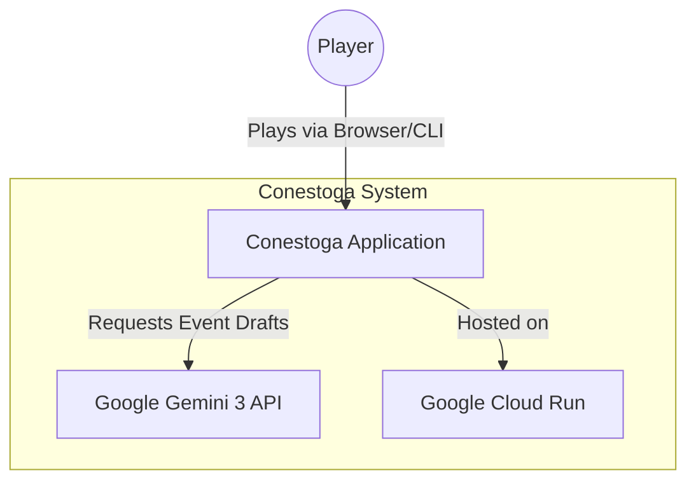
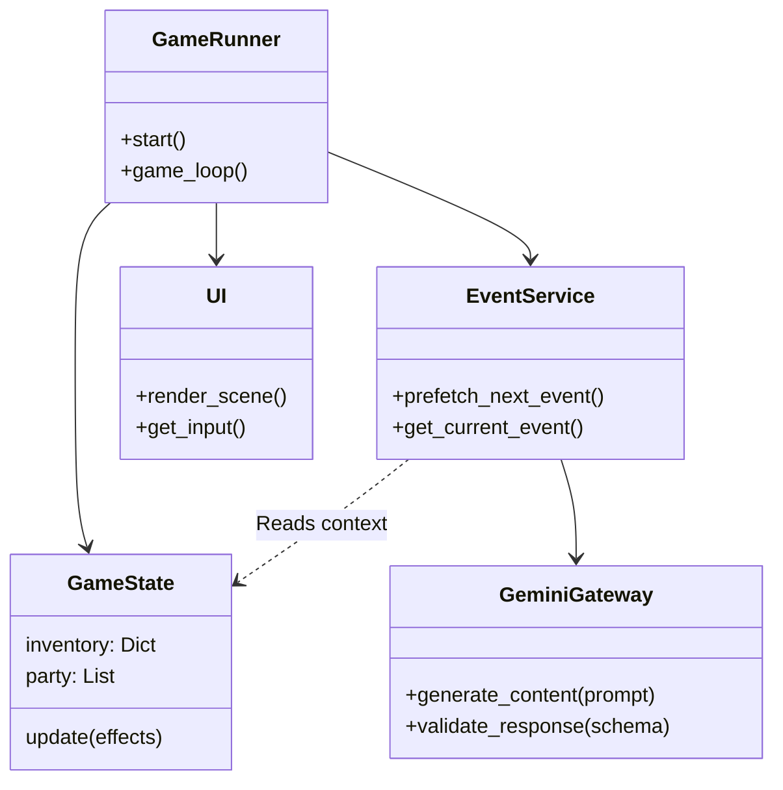
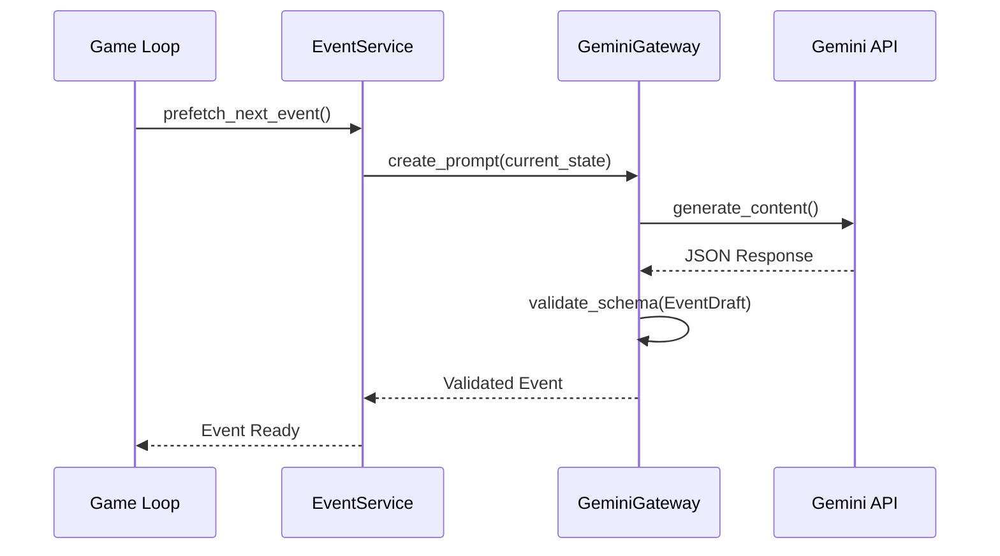
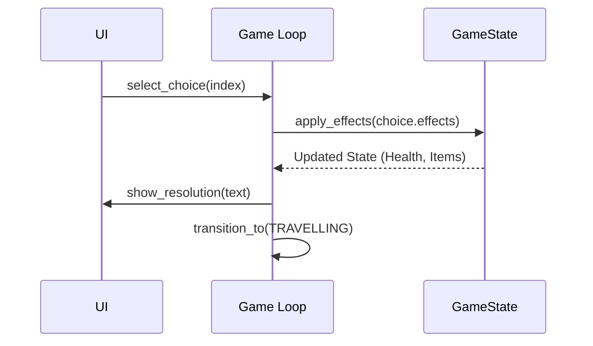
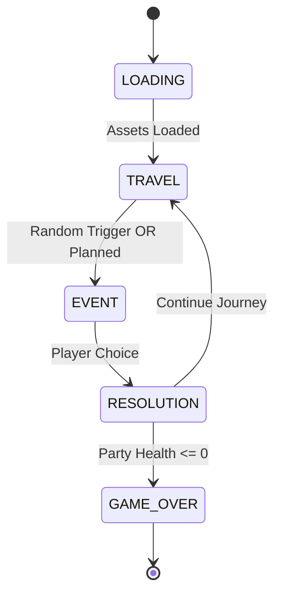

# Conestoga System Architecture

## Overview

Conestoga is built as a hybrid application: a deterministic Python game engine combined with a stochastic AI generation layer.

## Context Diagram (C4 Context)

## Component Architecture

## Critical Flows

### Event Generation (Prefetch)

This sequence runs in a background thread while the player is travelling.

### Event Resolution

When a player makes a choice.

## State Machine

